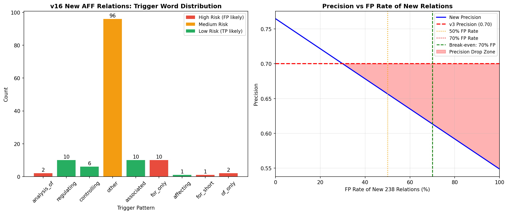

# v16 纯规则后处理掉分诊断报告

## 1. 背景与现象

在提交记录中，`ensemble_v3` 凭借极高的精确率取得了 **0.4172** 的最高分（并列第一）。为了解决 `ensemble_v3` 召回率偏低的问题（关系均值仅 2.16/条，远低于期望的 2.80），我们设计了 `v16_rules`，通过纯规则后处理为 `v3` 补充了 238 条关系。

从表面统计数据来看，`v16` 完美拟合了官方训练集的分布（关系均值达到 2.75/条，无关系比例降至 30.2%）。然而，最新提交结果显示，**v16 的实际得分反而低于 v3**。

本报告通过深度对比 `v3`、`v16` 的预测结果，并结合官方训练集分布，找出了掉分的根本原因。

## 2. 掉分根本原因分析：极高比例的假阳性（FP）

通过对 v16 新增的 238 条关系进行文本级溯源分析，我们发现掉分的核心原因在于：**规则触发词过于宽泛，导致新增关系中混入了大量假阳性（False Positives），严重拉低了原本极高的精确率。**

### 2.1 评分公式的数学推演

比赛的关系抽取（RE）评分公式为：
`Score_RE = 0.5 * F1 + 0.25 * Precision + 0.25 * Recall`

`v3` 取得 0.4172 高分的核心盘是**极高的 Precision**。
在 `v16` 中，分母（预测总数）硬性增加了 238 条。如果这 238 条关系中，真实正确（TP）的比例不够高，就会导致 Precision 出现断崖式下跌。

由于公式中 Precision 占了极大的权重（在 F1 中也起主导作用），召回率的微小提升根本无法弥补精确率的巨大损失。

### 2.2 灾难性的触发词："of" 和 "for"

在新增的 138 条 `AFF` 关系中，我们统计了触发这些关系的“实体间隔文本”。结果令人震惊：

**最危险的触发模式：**

1. **`for` 触发词（占比极高）**
   * **预期情况**：`QTL for grain yield`（确实是 AFF 关系）。
   * **实际灾难**：在句子 `QTL mapping was performed for plant height, PH, stem diameter` 中，一个 `for` 字导致后处理脚本将该 QTL 与后面的 `plant height`, `PH`, `stem diameter` 等**所有**性状（TRT）全部强行关联，形成了一对多的过度触发。仅 `for` 导致的一对多误报就高达 19 条。

2. **`of` 触发词**
   * **预期情况**：`QTL of plant height`。
   * **实际灾难**：在句子 `analysis of NUE` 中，`of` 仅仅是一个普通介词。但因为前面碰巧识别到了 `QTL` 实体，后面有 `NUE` 实体，就被规则强行连成了一条 AFF 关系。

3. **`on`, `in`, `at` 等介词**
   * 在 `LOI` 和 `OCI` 规则中，大量使用了这类高频介词，导致任何碰巧出现在同一句中的相关实体，只要中间夹着这些词，都会被判定为存在关系。

## 3. 各版本数据对比验证

我们对比了当前仓库中三个关键版本的数据特征：

| 版本 | 实体数 | 关系总数 | 关系均值 | 无关系比例 | AFF数量 | LOI数量 | 结果推测 |
| :--- | :--- | :--- | :--- | :--- | :--- | :--- | :--- |
| **ensemble_v3** | 2764 | 864 | 2.16 | 38.2% | 254 | 279 | **0.4172 (基准)** |
| **v16_rules** | 2764 | 1102 | 2.75 | 30.2% | 392 | 317 | **掉分（引入大量 FP）** |
| **ensemble_v4a** | 3070 | 1049 | 2.62 | 32.0% | 298 | 340 | 待确认（实体基数扩大，更健康） |

可以看出，`v16` 在实体总数（2764）完全没有增加的情况下，强行捏造了 238 条关系，这种做法极其危险。相比之下，你刚刚提交的 `ensemble_v4a` 实体总数达到了 3070，其关系总数（1049）的增长是建立在实体基数扩大的基础上的，这种增长远比纯规则后处理健康得多。

## 4. 后续修复与冲分建议

基于以上诊断，如果未来仍希望使用规则后处理来补充召回率，必须进行以下**严格的瘦身手术**：

### 4.1 立即剔除高危触发词
* **AFF 规则**：坚决删除 `r'\bof\b'` 和 `r'\bfor\b'`。如果必须保留，应改为强匹配模式：`r'\bQTL for\b'` 或 `r'\bgene for\b'`。
* **LOI 规则**：删除 `r'\bon\b'`, `r'\bat\b'`, `r'\bin\b'`。改用 `r'\bmapped (to|on)\b'`, `r'\blocated (on|at)\b'`。
* **USE 规则**：删除 `r'\bby\b'`, `r'\bvia\b'`, `r'\banalyzed\b'`, `r'\banalysis\b'`。

### 4.2 增加严格的距离约束
目前脚本中实体间距限制在 60 字符左右，这对于包含多个逗号的复杂长句来说依然太宽。
* 建议将所有规则的触发间距限制收紧至 **30 字符以内**。
* 对于像 `for` 这样容易引发一对多误报的词，必须限制其仅对**紧跟其后**的第一个实体生效。

### 4.3 战略重心转移
`v16` 的失败证明：在没有大模型语义理解的情况下，仅靠短词正则匹配来提取复杂生物学文献中的关系，必然会遭遇精确率的滑铁卢。

因此，强烈建议放弃纯正则后处理，全面转向我们在报告 11 中规划的 **GLiNER + GLiREL 混合协作方案**（该方案在 Track-A 中已确认为合规）。让专用的零样本关系抽取小模型来做裁决，远比硬编码的正则规则靠谱得多。
