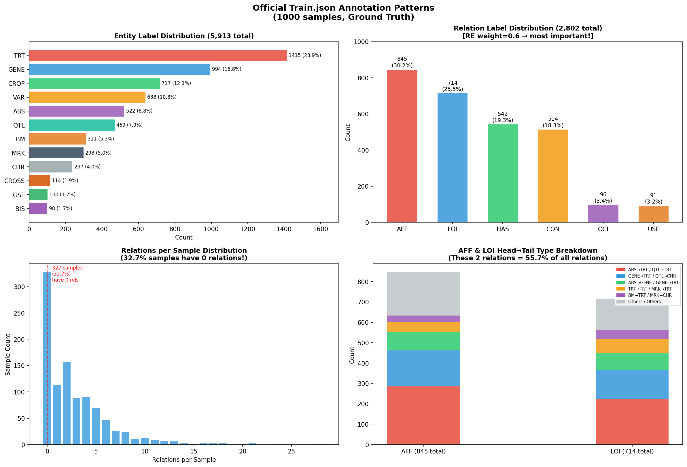
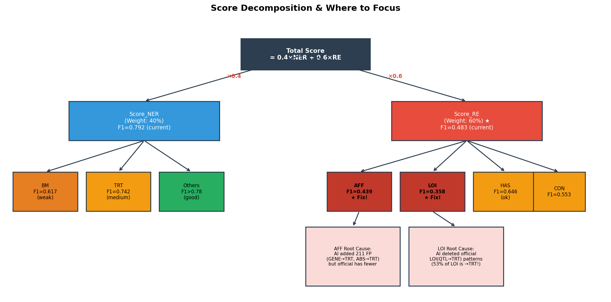

# CCL2026-MGBIE 比赛重构方案：以得分为准绳的删繁就简策略

## 1. 核心痛点与重构思路

在之前的尝试中，你使用 AI 助手对官方训练集进行了“学术级”的审查与修正。虽然这种做法在学术上严谨，但在**数据科学比赛**中却是一个致命的陷阱。

比赛的唯一准绳是**官方测试集的 Ground Truth**。官方的标注标准往往带有一定的领域偏好、简化处理甚至“系统性偏差”。如果你的模型学习了“完美但与官方不一致”的标准，在测试集上必然会遭遇滑铁卢。

通过对官方 1000 条原始训练数据的深度分析，我们发现了以下关键事实：
1. **RE（关系抽取）决定成败**：官方评分公式中，RE 权重占 60%，NER 占 40%。
2. **官方的特殊偏好**：官方大量使用了 `LOI(QTL, TRT)` 和 `LOI(GENE, TRT)` 这种在学术上可能被认为不严谨的“定位于”关系（占所有 LOI 关系的 53%）。而你的 AI 助手把这些全删了，改成了 `AFF`。
3. **32.7% 的样本没有关系**：官方数据中有三分之一的句子只标了实体，没有标关系。

**重构核心思路：放弃“纠错”，全面拥抱“官方标准”。删繁就简，直接利用官方原始数据构建比赛方案。**

## 2. 赛道选择与模型策略

比赛分为 Track-A（不微调，无限参数）和 Track-B（微调，≤7B 参数）。为了最大化得分并降低工程复杂度，建议采取以下策略：

### 方案 A：主攻 Track-A（In-Context Learning）
这是最轻量、最快见效的方案。不需要训练模型，直接利用顶尖大模型（如 GPT-4o、Claude 3.5 Sonnet 或 Qwen-Max）的上下文学习能力。

*   **策略**：构建一个强大的 Prompt，将官方原始训练集中的**高频模式**作为 Few-shot 示例喂给大模型，让其直接预测 A 榜测试集。
*   **优势**：无需算力，无需处理数据格式对齐，大模型自带强大的泛化能力。
*   **劣势**：受限于 Prompt 长度，无法让模型看遍 1000 条训练数据。

### 方案 B：稳扎稳打 Track-B（LoRA 微调）
如果你有 GPU 算力（如单卡 RTX 3090/4090），这是最能贴近官方标准的方案。

*   **策略**：使用官方原始的 1000 条 `train.json`（**绝对不要用你修正过的数据**），将其转换为指令微调格式（Instruction Tuning），使用 Llama-Factory 等框架对 Qwen2.5-7B 或 Llama3-8B 进行 LoRA 微调。
*   **优势**：模型能深度记忆官方的标注偏好（如 `LOI(QTL, TRT)`），在测试集上表现最稳定。
*   **劣势**：需要算力支持，需要编写数据转换脚本和训练脚本。

## 3. 删繁就简的执行路径（以 Track-A 为例）

如果你选择最快的 Track-A，以下是具体的执行步骤：

### 第一步：废弃现有修正流程
停止运行 `mgbie-ner-annotator` 和 `mgbie-review-agent`。清空或封存 `bisai` 仓库中 `数据/训练集/修订结果` 目录下的所有文件。这些文件不仅包含格式错误，更包含致命的标准偏移。

### 第二步：提炼官方“黄金法则”
根据深度分析，在构建 Prompt 时，必须向大模型强调官方的特殊标注规律：



1.  **实体识别（NER）法则**：
    *   重点关注 `TRT`（性状，占 23.9%）、`GENE`（基因，占 16.8%）和 `CROP`（作物，占 12.1%）。
    *   **不要过度标注**：实验技术（如 GWAS、RNA-seq）可以标为 `BM`，但不要把普通的分析方法（如 QTL analysis）标为 `BM`。
2.  **关系抽取（RE）法则**：
    *   **AFF（影响）**：主要用于 `ABS(胁迫) -> TRT(性状)` 和 `GENE -> TRT`。
    *   **LOI（定位于）**：**必须遵循官方习惯**，大胆使用 `QTL -> TRT` 和 `QTL -> CHR`。不要自作主张把 `QTL -> TRT` 改成 `AFF`。
    *   **HAS（具有）**：主要用于 `VAR(品种) -> TRT` 和 `CROP -> TRT`。

### 第三步：构建 Few-shot Prompt
从官方 `train.json` 中挑选 5-8 条最具代表性的样本（必须包含上述高频关系组合），构建如下结构的 Prompt：

```text
你是一个专业的杂粮育种信息抽取专家。你的任务是从文本中抽取命名实体（NER）和关系（RE）。
请严格遵循以下官方标注偏好，不要使用你自带的学术纠错逻辑：
1. 关系 LOI（定位于）经常用于 QTL 定位于 TRT（性状）或 CHR（染色体）。
2. 关系 AFF（影响）经常用于 ABS（胁迫）影响 TRT，或 GENE 影响 TRT。
3. 关系 HAS（具有）经常用于 VAR（品种）具有 TRT。

以下是几个标准示例：
[示例 1：包含 LOI(QTL, TRT) 的官方原始样本]
[示例 2：包含 AFF(ABS, TRT) 的官方原始样本]
[示例 3：包含 HAS(VAR, TRT) 的官方原始样本]

现在，请对以下文本进行抽取，并严格输出 JSON 格式：
[测试集文本]
```

### 第四步：批量预测与提交
编写一个 Python 脚本，读取 `test_A.json` 的 400 条文本，循环调用大模型 API（带上上述 Prompt），将返回的 JSON 结果保存，最后打包为 `submit.zip` 提交天池。

## 4. 总结

比赛的本质是**拟合官方的分布**，而不是**追求学术的绝对真理**。



如上图所示，RE 占了 60% 的权重，而你在 RE 上的失分主要来自于 AI 强行纠正了官方的 `AFF` 和 `LOI` 标注习惯。

**重构方案的核心就是四个字：原汁原味。** 放弃你仓库里那些经过 AI 深度审查和修改的数据，直接用官方给的 1000 条原始数据。要么用它们做 Few-shot 打 Track-A，要么用它们做微调打 Track-B。这是拿高分的唯一捷径。
